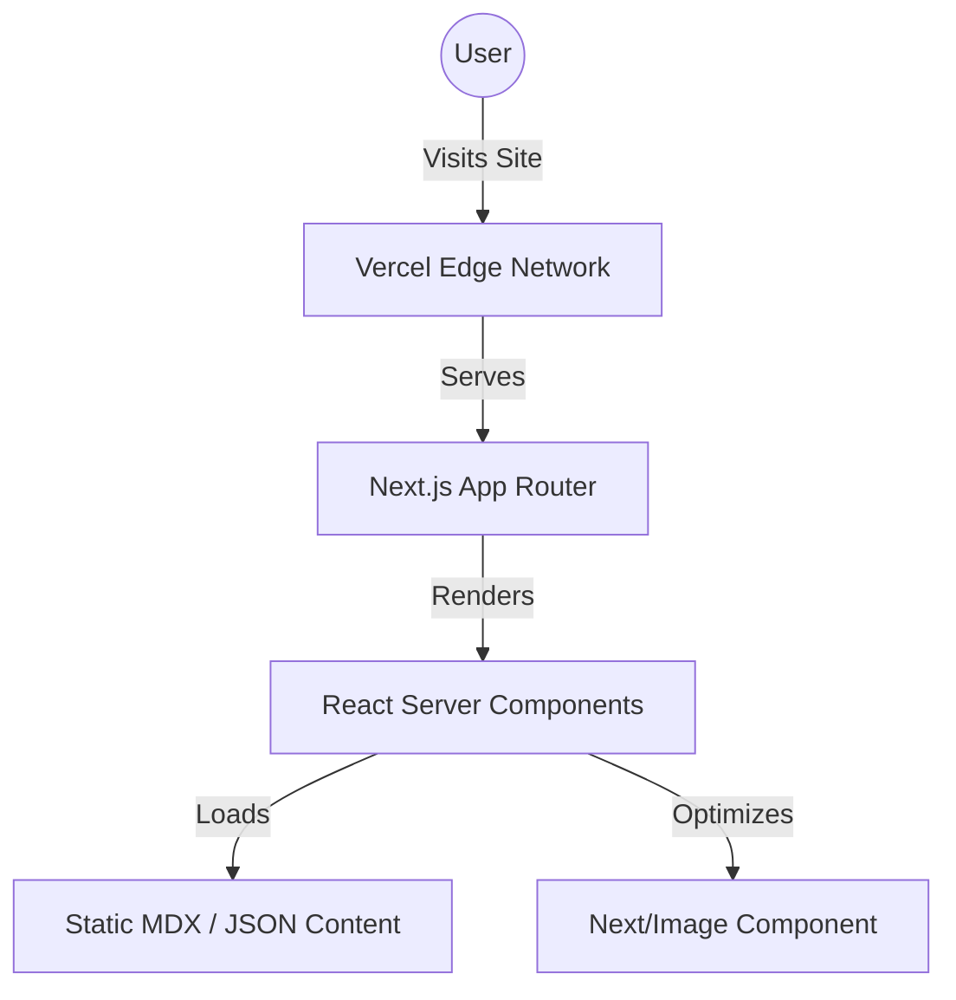

# Atlas of My Skies 🌌


A meditative, digital astronomy diary that maps the sky above me each day. A quiet intersection of photography, personal reflection, and code.

## 🔭 About the Project

*Atlas of My Skies* is a personal web project built to document astrophotography, stargazing logs, and astronomical events. The platform is designed to be minimalistic and focus heavily on the imagery and the storytelling.

- **Stack:** Built with Next.js 14+ (App Router), React, and TypeScript.
- **Deployment:** Hosted on Vercel for fast edge delivery of static assets and images.
- **Design:** Custom minimalist aesthetics, dark mode by default to match the night sky.

## 🚀 Getting Started

To run this project locally:

```bash
# 1. Clone the repository
git clone https://github.com/smmariquit/atlas-of-my-skies.git
cd atlas-of-my-skies

# 2. Install dependencies
npm install

# 3. Start the development server
npm run dev
```

Open [http://localhost:3000](http://localhost:3000) with your browser to view the application.

## 🗺️ Architecture



## 📄 License

This project is open-source under the MIT License, though the photography and written content remain copyrighted by the author.

---
*If this project helped you out, consider [treating me to a coffee](https://kape.stimmie.dev) ☕*

## 📊 Current State of the Code
- **Tech Stack:** React, TailwindCSS, Next.js, Node.js/NPM
- **Repository Size:** 143 tracked files
- **Latest Update:** `fdd4714 chore: add stale issue and PR validators`

---
*☕ If you found this project useful, you can support my work at [kape.stimmie.dev](https://kape.stimmie.dev)!*